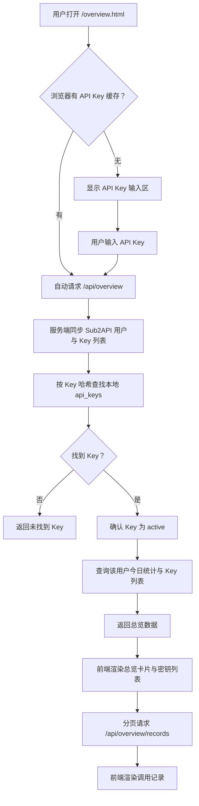

# 用户总览页设计规格

## 背景

当前应用已经提供排行榜页面，用户输入 API Key 后可以查看自己的日榜、月榜位置。新的用户总览页用于回答另一个问题：用户想知道「我今天整体用了多少」以及「最近有哪些调用记录」。

本次设计只覆盖普通用户视角，不包含管理员配置、管理员页面或管理员交互。

## 目标

- 用户可以通过一个 API Key 查看该 Key 所属用户的整体用量总览。
- 页面复用排行榜已经缓存在浏览器 `localStorage` 中的 API Key；没有缓存时才要求输入。
- 展示今日用量情况。
- 展示调用记录，并支持分页。
- 不展示 token 消耗。

## 非目标

- 不做管理员配置。
- 不做管理员可见 Key 管理。
- 不做 token 消耗展示。
- 不做实时推送。
- 不做复杂筛选、导出、图表分析。
- 不把用户输入的 API Key 保存到服务端数据库。

## 页面与入口

新增页面：`/overview.html`。

排行榜页面增加一个用户可见的导航入口：

- 「排行榜」
- 「我的总览」

两个页面使用同一个浏览器缓存键：`sub2api_rank_user_key`。

用户体验：

1. 如果浏览器已有缓存 API Key，打开「我的总览」后自动加载数据。
2. 如果没有缓存，页面显示 API Key 输入区域。
3. 用户输入 API Key 后，前端写入 `localStorage`，随后加载总览数据。
4. 用户可以在页面上更换 API Key。

## 页面布局

采用「总览优先」布局。

页面从上到下分为 4 个区域：

1. 顶部导航与标题
   - 标题：`我的修行总览`
   - 导航：`排行榜`、`我的总览`
   - 显示上次刷新时间
2. 今日总览卡片
   - 今日消耗
   - 今日请求数
   - 活跃密钥数
   - 今日状态
3. 我的密钥概览
   - 展示当前用户下的 API Key 列表
   - 每个 Key 展示名称、脱敏 Key、状态、今日消耗、今日请求数
   - 只做浏览，不做管理操作
4. 调用记录
   - 表格展示最近调用记录
   - 支持上一页、下一页、页码、每页数量

## 文案原则

页面面向普通 API 使用者，而不是开发者或管理员。

允许出现的文案示例：

- `今日用量`
- `今日消耗`
- `请求次数`
- `调用记录`
- `上一页`
- `下一页`
- `暂无调用记录`
- `请先输入 API Key`

避免出现的文案：

- `admin`
- `内部映射`
- `服务端缓存`
- `接口调试信息`

## 数据来源

服务端仍然使用环境变量中的 `ADMIN_KEY` 请求 Sub2API 管理接口，但这个能力只用于服务端查询数据，不暴露给前端。

用户输入的 API Key 用于识别所属用户。每次打开用户总览页时，服务端先同步一次 Sub2API 用户与 Key 列表，把最新 Key 信息写入本地数据库，再按 Key 哈希查找对应的 `api_key_id` 和用户归属。

如果同步后仍然找不到该 API Key，服务端返回明确错误：`未找到这个 API Key，请确认后再试`。

## 后端接口设计

### `POST /api/overview`

请求体：

```json
{
  "apiKey": "用户输入的 API Key"
}
```

响应体：

```json
{
  "refreshedAt": "2026-05-31T12:00:00.000Z",
  "user": {
    "id": "123"
  },
  "summary": {
    "todayCost": 3.82,
    "todayRequests": 186,
    "activeKeyCount": 4,
    "statusName": "火力全开"
  },
  "keys": [
    {
      "id": "10",
      "name": "金鳞主钥",
      "maskedKey": "sk-****abcd",
      "status": "active",
      "todayCost": 2.18,
      "todayRequests": 98
    }
  ]
}
```

### `POST /api/overview/records`

请求体：

```json
{
  "apiKey": "用户输入的 API Key",
  "page": 1,
  "pageSize": 20
}
```

响应体：

```json
{
  "page": 1,
  "pageSize": 20,
  "total": 360,
  "items": [
    {
      "id": "9001",
      "createdAt": "2026-05-31T11:58:00.000Z",
      "keyName": "金鳞主钥",
      "maskedKey": "sk-****abcd",
      "model": "gpt-4.1",
      "requestType": "stream",
      "cost": 0.042,
      "durationMs": 1300,
      "status": "success"
    }
  ]
}
```

## 后端数据流



## Sub2API 接口使用

服务端需要新增 Sub2API client 方法：

- `listAdminUsage(params)`：请求 `GET /admin/usage`
- `getAdminUsageStats(params)`：请求 `GET /admin/usage/stats`
- `listUserAPIKeys(userId)`：复用已有方法
- `listUsers()`：复用已有方法

日期使用 `timezone=Asia/Shanghai`，今日范围按东八区计算。

调用记录按以下参数查询：

- `user_id`
- `page`
- `page_size`
- `sort_by=created_at`
- `sort_order=desc`
- `timezone=Asia/Shanghai`

今日统计按以下参数查询：

- `user_id`
- `period=today`
- `timezone=Asia/Shanghai`

单个 Key 的今日数据按 `api_key_id` 查询，用于密钥概览。

## API Key 归属识别

现有数据库 `api_keys` 表只有 Key 自身信息，没有 `user_id`。本功能需要让本地 Key 缓存包含用户归属。

调整方式：

- `api_keys` 表增加 `user_id` 字段。
- 刷新用户 Key 列表时，把用户 ID 写入每个 Key。
- 通过 Key 哈希找到 Key 后，即可得到所属用户 ID。

这属于当前需求的最小必要数据，不是额外管理功能。

## 今日状态规则

今日状态只用于总览卡片，不影响排行榜规则。

按今日消耗金额展示：

| 最小金额 | 状态名 |
| --- | --- |
| 0 | 静心观望 |
| 1 | 初燃灵火 |
| 5 | 灵泉涌动 |
| 20 | 御剑疾行 |
| 60 | 剑气如虹 |
| 150 | 一日千里 |
| 300 | 破晓登峰 |

## 错误处理

错误信息必须面向用户：

- 未输入 API Key：`请先输入 API Key`
- 未找到 Key：`未找到这个 API Key，请确认后再试`
- Key 非启用状态：`这个 API Key 当前不可用`
- 查询失败：`总览暂时无法打开，请稍后再试`

禁止在前端展示内部接口路径、堆栈、管理员信息或调试细节。

## 测试要求

新增或更新测试覆盖：

1. Sub2API client
   - `GET /admin/usage` URL 与查询参数正确。
   - `GET /admin/usage/stats` URL 与查询参数正确。
2. 数据库
   - `api_keys.user_id` 迁移存在。
   - `findAPIKeyByHash` 返回 `userId`。
3. 服务层
   - 输入已缓存且 active 的 Key，返回用户今日总览。
   - 请求用户总览时，会先同步一次 Key 列表再查找。
   - 输入不存在的 Key，返回用户可读错误。
   - 输入非 active Key，返回用户可读错误。
   - 调用记录分页参数正确传递。
4. 前端纯函数
   - 金额、时间、分页文案格式化正确。
   - 缓存 API Key 后自动加载。

完成后运行：

```bash
npm test
```

## 验收标准

- 打开 `/overview.html`，如果排行榜页面已经缓存 API Key，不需要重新输入。
- 页面展示今日消耗、今日请求数、活跃密钥数、今日状态。
- 页面不展示 token 消耗。
- 页面展示该用户下的 Key 列表和每个 Key 的今日消耗。
- 调用记录支持分页切换。
- 前端不会出现管理员文案或实现细节文案。
- 所有自动化测试通过。
